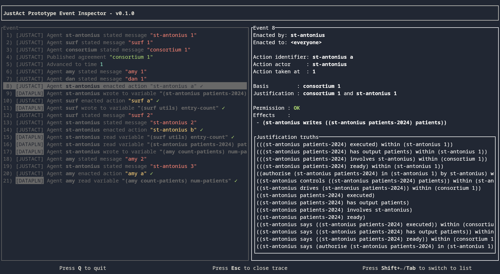

# Trace inspector
This part of the repository implements a visual trace inspector for traces produced by the prototype.

For example:



## Usage
The [prototype implementation](../../README.md) produces a trace of events that acts as an audit trace for what the system is doing. For example, it may produce the following:
```json
{
    "Control": {
        "kind": "StateMessage",
        "who": "st-antonius",
        "to": "All",
        "msg": {
            "id": ["st-antonius",1],
            "payload": "// Statement (st-antonius 1).\n(st-antonius patients-2024) has output patients.\n(st-antonius patients-2024) ready.\nst-antonius controls ((st-antonius patients-2024) patients).\n\n(st-antonius patients-2024) executed.\nauthorise (st-antonius patients-2024) in (st-antonius 1) by st-antonius.\n"
        }
    }
}
```
to denote that some agent (`st-antonius`) stated a message with ID `st-antonius 1` to all other agents.

These traces can be made visual by this binary. It expects them given sequentially on either stdin or via file, and will show an interface to interactively inspect every event. Further, it also runs the Slick interpreter in the background to decide whether actions are permitted and whether data accesses (when used with the prototype's dataplane) are contextualised within a valid action, as described in the paper \[2\].

### Running the inspector
Specifically, you can run the inspector to read traces from stdin like so:
```sh
cargo run --package inspector
```
Alternatively, if you would like to read from a file, you can run it with the `--path`-command:
```sh
cargo run --package inspector -- --path XXX
```
where `XXX` is the path to the file.
